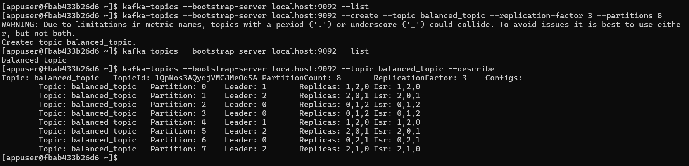
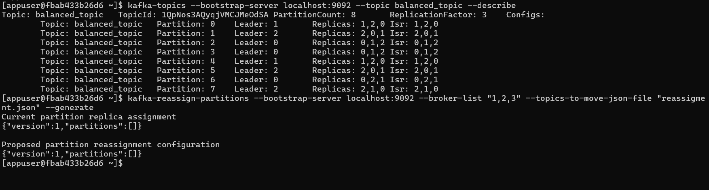
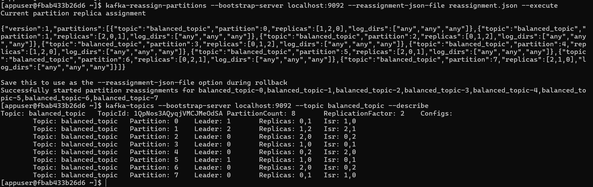
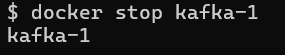
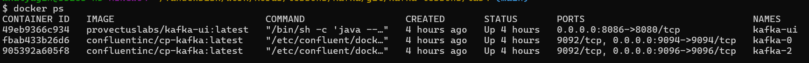
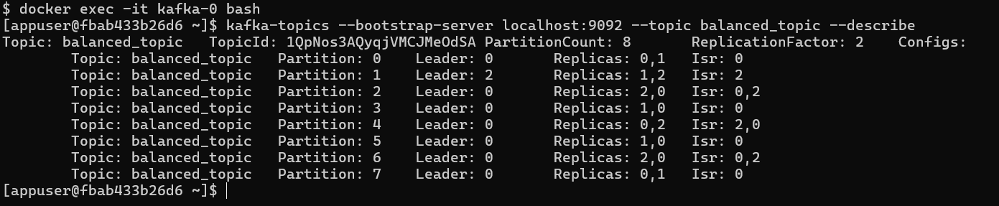
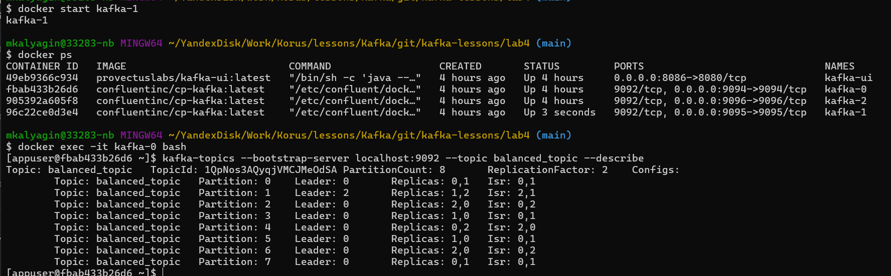
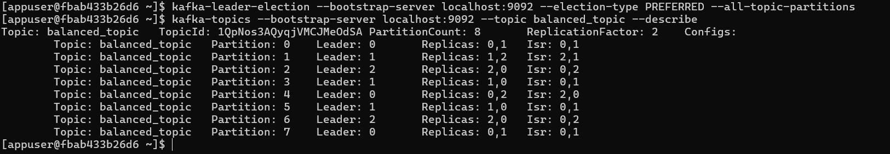

# Описание по первой задаче

* docker-compose.yaml - файл для первой задачи, где нужно ребалансировать топик

Для работы необходимо поднять docker compose:
```shell
docker compose up -d
```
После того как кластер поднимится, выполняем след команды.
Все команды и результаты представлены на скриншотах


## Создаем топик и смотрим о нем информацию



## Файл с необходимым распределением партиций
```json{
  "version": 1,
  "partitions": [
    {"topic": "balanced_topic", "partition": 0, "replicas": [0, 1], "log_dirs": ["any", "any"]},
    {"topic": "balanced_topic", "partition": 1, "replicas": [1, 2], "log_dirs": ["any", "any"]},
    {"topic": "balanced_topic", "partition": 2, "replicas": [2, 0], "log_dirs": ["any", "any"]},
    {"topic": "balanced_topic", "partition": 3, "replicas": [1, 0], "log_dirs": ["any", "any"]},
    {"topic": "balanced_topic", "partition": 4, "replicas": [0, 2], "log_dirs": ["any", "any"]},
    {"topic": "balanced_topic", "partition": 5, "replicas": [1, 0], "log_dirs": ["any", "any"]},
    {"topic": "balanced_topic", "partition": 6, "replicas": [2, 0], "log_dirs": ["any", "any"]},
    {"topic": "balanced_topic", "partition": 7, "replicas": [0, 1], "log_dirs": ["any", "any"]}
  ]
}
```

## Генерируем план по распределению



## Перераспределяем по заданному файлу и смотрим что поменялось


## Стопаем кафку


## Смотрим что нет 1 брокера


## Смотрим что там с топиком после того как нет 1 брокера


Видим что Isr - неправильный,а так же у почти всех партиций лидер - 0 брокер, не сбалансированно.

## Поднимаем обратно брокер и смотрим что там


Inr появились,  но все равно нужна ребалансировка.

## Ребалансируем автоматически, чтобы исправить ситуацию


# Описание по второй задаче


* docker-compose-task2.yaml - файл для второй задачи, где нужно ребалансировать топик
* папка producer - содержит простой код, для того чтобы посылать сообщения в кафку от пользователя alice
* папка consumer - содержит простой код, для того чтобы получать сообщения из кафку с помощью пользователя alice

Для работы необходимо поднять docker compose:
```shell
docker compose -f docker-compose-task2.yaml up -d
```

Для настройки прав необходимо на пример на брокере kafka-1 выполнить след. действия


**Заходим на kafka-1**
```
docker exec -it kafka-1 bash
```

Этот конфиг будем использовать для админитрирования кафки т.к. используем пользователя admin, который указан как superuser в docker compose переменных
```shell
echo 'security.protocol=SASL_SSL
sasl.mechanism=PLAIN
sasl.jaas.config=org.apache.kafka.common.security.plain.PlainLoginModule required username="admin" password="admin-secret";
# Path to the keystore (if client authentication is required)
ssl.keystore.location=/etc/kafka/secrets/kafka.kafka.keystore.pkcs12
ssl.keystore.password=123456
ssl.key.password=123456
# Path to the truststore
ssl.truststore.location=/etc/kafka/secrets/kafka.kafka.truststore.jks
ssl.truststore.password=123456
ssl.endpoint.identification.algorithm=' >> prop.cfg
```

Для продюсера
```shell
kafka-acls --bootstrap-server localhost:9092 \
--add \
--allow-principal User:alice \
--operation write \
--operation read \
--operation create \
--topic app-topic \
--command-config prop.cfg
```


Это для кансамера
```shell
kafka-acls --bootstrap-server localhost:9092 \
--add \
--allow-principal User:alice \
--operation all \
--group app-group \
--command-config prop.cfg
```


### Замечания

Задача о том чтобы ограничить именно через ACL подлючение к конкреному брокеру, я в оф. документации не нашел, там есть 2 параметра 
```
--allow-hosts
--deny-hosts
```
но это параметры С каких разрешено или С каких запрещено подключаться. Но чтобы определяеть к какому брокеру подключаться через ACL такого не нашел.
